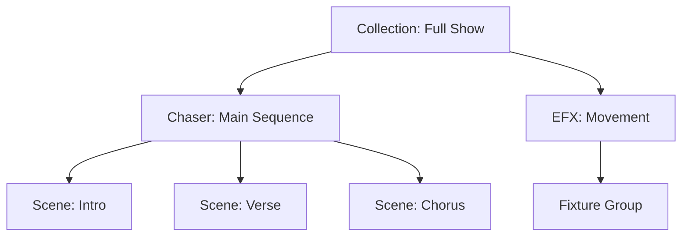

## Overview

**Functions** are the core building blocks for creating lighting shows in QLC+. They define what happens to your fixtures over time - from static scenes to complex sequences and effects.

<Info>
Functions can be nested and combined, allowing you to build sophisticated shows from simple components.
</Info>

## Function Types

QLC+ provides several function types, each suited for different use cases:

```cpp
enum Type {
    SceneType      = 1 << 0,   // Static channel values
    ChaserType     = 1 << 1,   // Sequence of steps
    EFXType        = 1 << 2,   // Automated movement effects
    CollectionType = 1 << 3,   // Group of functions
    ScriptType     = 1 << 4,   // JavaScript automation
    RGBMatrixType  = 1 << 5,   // Pixel mapping effects
    ShowType       = 1 << 6,   // Timeline-based programming
    SequenceType   = 1 << 7,   // Chaser snapshot
    AudioType      = 1 << 8,   // Audio playback
    VideoType      = 1 << 9    // Video playback
};
```

### Scene

A **Scene** captures a static lighting state - specific DMX values for selected channels.

<Card title="Use Cases" icon="lightbulb">
- Stage washes (all fixtures to a specific color/intensity)
- Preset positions for moving heads
- Lighting states for different show sections
</Card>

**Key Features**:
- Set individual channel values (0-255)
- Control any number of fixtures
- Instant or faded transitions
- Blend modes (Normal, Mask, Additive, Subtractive)

### Chaser

A **Chaser** is a sequence of steps executed in order.

```cpp
Chaser *chase = new Chaser(doc);
chase->setName("Color Sequence");

// Add steps (can be Scenes or other functions)
chase->addStep(sceneRed);
chase->addStep(sceneBlue);
chase->addStep(sceneGreen);

// Configure timing
chase->setDuration(1000);    // 1 second per step
chase->setFadeInSpeed(500);  // 500ms fade in
```

**Run Orders**:
- **Loop**: Continuous repeat (1→2→3→1→2→3...)
- **Single Shot**: Run once and stop
- **Ping Pong**: Forward then reverse (1→2→3→2→1)
- **Random**: Random step selection

### EFX (Effects)

**EFX** functions create automated movement patterns for fixtures with pan/tilt.

<CardGroup cols={2}>
  <Card title="Circle" icon="circle">
    Circular pan/tilt movement
  </Card>
  <Card title="Eight" icon="infinity">
    Figure-8 pattern
  </Card>
  <Card title="Line" icon="minus">
    Linear sweep
  </Card>
  <Card title="Triangle" icon="triangle">
    Triangular path
  </Card>
</CardGroup>

**Parameters**:
- Width/Height (movement range in degrees)
- X/Y Offset (center position)
- Rotation (pattern orientation)
- Start Offset (phase shift between fixtures)
- Direction (Forward/Backward)

### Collection

A **Collection** runs multiple functions simultaneously.

```cpp
Collection *coll = new Collection(doc);
coll->setName("Full Stage");

// Add functions to run together
coll->addFunction(sceneBacklight);
coll->addFunction(chaserFrontRow);
coll->addFunction(efxMovement);
```

Useful for combining lighting elements that should start together.

### RGB Matrix

**RGB Matrix** generates pixel-mapped effects for LED fixtures.

**Built-in Patterns**:
- Text scrolling
- Geometric shapes
- Plasma effects
- Fire simulation
- Animated graphics

**Configuration**:
- Fixture layout (grid arrangement)
- Effect selection and parameters
- Color palette
- Animation speed and direction

### Show

A **Show** provides timeline-based programming with precise timing control.

**Features**:
- Visual timeline interface
- Multiple parallel tracks
- Precise timing (millisecond accuracy)
- Mix of different function types
- Audio synchronization

### Sequence

A **Sequence** is a special chaser type that captures absolute channel values at each step, rather than referencing other scenes.

<Note>
Sequences are created from the Simple Desk or by recording live changes. They're useful for storing complete snapshots.
</Note>

## Function Properties

### Common Properties

All functions share these properties:

```cpp
class Function {
    quint32 m_id;                // Unique identifier
    QString m_name;              // Display name
    QString m_path;              // Folder organization
    RunOrder m_runOrder;         // Loop, Single Shot, etc.
    Direction m_direction;       // Forward/Backward
    TempoType m_tempoType;       // Time or Beats
};
```

### Timing Control

#### Speed Parameters

```cpp
// Time-based (milliseconds)
function->setFadeInSpeed(1000);   // 1 second fade in
function->setDuration(5000);       // 5 second hold
function->setFadeOutSpeed(2000);   // 2 second fade out

// Or beat-based
function->setTempoType(Beats);
function->setDuration(4000);  // 4 beats (4.000 in UI)
```

<Info>
Beat-based timing automatically adjusts to BPM changes, perfect for music-synchronized shows.
</Info>

#### Tempo Types

- **Time**: Absolute milliseconds (ms)
- **Beats**: Synchronized to Master Timer BPM

### Intensity Attribute

All functions support intensity control:

```cpp
// Adjust function intensity (0.0 to 1.0)
int attrId = function->requestAttributeOverride(Function::Intensity, 0.5);

// Later adjustment
function->adjustAttribute(0.75, attrId);

// Release control
function->releaseAttributeOverride(attrId);
```

Used by:
- Virtual Console sliders (submaster control)
- Chaser steps (vary intensity per step)
- Grand Master override

## Function Hierarchy

Functions can contain other functions, creating powerful hierarchies:



### Parent-Child Relationships

When a parent function starts:
1. Child functions inherit override values (speed, intensity)
2. Children respect parent's running order
3. Stopping parent stops all children

```cpp
// Child inherits parent overrides
void Function::start(MasterTimer* timer, 
                     FunctionParent parent,
                     uint overrideFadeIn,
                     uint overrideFadeOut,
                     uint overrideDuration) {
    // Children use parent's overrides if provided
}
```

## Running Functions

### Lifecycle

1. **Start**: Function is added to Master Timer
2. **preRun**: Initialization, setup faders
3. **write**: Generate DMX values each tick
4. **postRun**: Cleanup, fade out
5. **Stop**: Removed from Master Timer

```cpp
// Start a function
function->start(masterTimer, FunctionParent::master());

// Pause/unpause
function->setPause(true);
function->setPause(false);

// Stop
function->stop(FunctionParent::master());
```

### Master Timer Integration

The Master Timer runs all active functions:

- Calls `write()` every 50ms (20 Hz)
- Manages faders and priority
- Coordinates HTP/LTP merging
- Handles Grand Master scaling

## Blend Modes

Functions can use different blend modes when writing to universes:

```cpp
enum BlendMode {
    NormalBlend,      // Standard HTP/LTP rules
    MaskBlend,        // Multiply values (dimming effect)
    AdditiveBlend,    // Add to existing values
    SubtractiveBlend  // Subtract from existing values
};
```

**Example Use Cases**:
- **Mask**: Dim a running scene without modifying it
- **Additive**: Layer effects without overriding base scene
- **Subtractive**: Create negative/cutout effects

## Practical Examples

### Creating a Simple Scene

```cpp
Scene *scene = new Scene(doc);
scene->setName("Red Wash");

// Set fixture channel values
scene->setValue(fixtureId, 0, 255);  // Channel 0 = 255 (dimmer)
scene->setValue(fixtureId, 1, 255);  // Channel 1 = 255 (red)
scene->setValue(fixtureId, 2, 0);    // Channel 2 = 0 (green)
scene->setValue(fixtureId, 3, 0);    // Channel 3 = 0 (blue)

// Add to document
doc->addFunction(scene);
```

### Building a Color Chase

```cpp
// Create scenes
Scene *red = createColorScene("Red", 255, 0, 0);
Scene *green = createColorScene("Green", 0, 255, 0);
Scene *blue = createColorScene("Blue", 0, 0, 255);

// Create chaser
Chaser *chase = new Chaser(doc);
chase->setName("RGB Chase");
chase->addStep(red);
chase->addStep(green);
chase->addStep(blue);

// Configure timing
chase->setDuration(1000);      // 1 second per step
chase->setFadeInSpeed(250);    // 250ms crossfade
chase->setRunOrder(Loop);

doc->addFunction(chase);
```

### Circular Movement Effect

```cpp
EFX *circle = new EFX(doc);
circle->setName("Circle Pattern");

// Set algorithm
circle->setAlgorithm("Circle");

// Add fixtures
circle->addFixture(movingHead1);
circle->addFixture(movingHead2);

// Configure pattern
circle->setWidth(180);   // 180° pan range
circle->setHeight(90);   // 90° tilt range
circle->setXOffset(90);  // Center at 90°
circle->setYOffset(45);  // Center at 45°

// Set timing
circle->setDuration(10000);  // 10 seconds per cycle

doc->addFunction(circle);
```

## Best Practices

1. **Naming**: Use clear, descriptive names for functions
2. **Organization**: Use paths to organize functions by type or show section
3. **Modularity**: Build complex shows from simple, reusable functions
4. **Timing**: Start with time-based, switch to beats for music sync
5. **Testing**: Test functions individually before combining
6. **Fade Times**: Always set appropriate fade times for smooth transitions

## Performance Considerations

- **HTP Checking**: Intensive for many overlapping scenes
- **EFX Calculations**: Complex algorithms can be CPU-intensive
- **Fade Optimization**: Faders are created/destroyed dynamically
- **Function Depth**: Limit nesting depth to avoid overhead

<Warning>
Running hundreds of functions simultaneously may impact performance. Use collections and shows strategically.
</Warning>

## Related Concepts

- [Universes](/concepts/universes) - Where function output is written
- [Fixtures](/concepts/fixtures) - What functions control
- [Virtual Console](/concepts/virtual-console) - Triggering functions during shows
