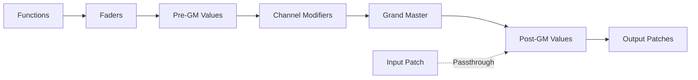

## Overview

In QLC+, a **Universe** represents a DMX universe - a collection of 512 DMX channels used to control lighting fixtures and effects. The Universe class is the fundamental container for managing input/output data and translating control values into DMX signals.

<Info>
QLC+ supports multiple universes, allowing you to control more than 512 channels by organizing fixtures across different DMX universes.
</Info>

## Universe Basics

### Size and Structure

Each universe in QLC+ contains exactly **512 channels** (defined as `UNIVERSE_SIZE`), following the DMX512 standard. Each channel can hold a value from 0 to 255.

```cpp
#define UNIVERSE_SIZE 512
```

### Universe Properties

- **ID**: Zero-based universe identifier (e.g., Universe 0, Universe 1)
- **Name**: Friendly name for easy identification
- **Passthrough Mode**: Allows input signals to pass directly to output
- **Monitor Mode**: Enables monitoring of universe changes

## Channel Types

QLC+ categorizes channels into different types to optimize DMX value processing:

### HTP (Highest Takes Precedence)

Used primarily for **intensity channels**. When multiple functions control the same channel, the highest value wins.

```cpp
enum ChannelType {
    LTP        = 1 << 0,  // Latest Takes Precedence
    HTP        = 1 << 1,  // Highest Takes Precedence  
    Intensity  = 1 << 2   // Intensity channel flag
};
```

### LTP (Latest Takes Precedence)

Used for **position, color, and control channels**. The most recent value takes priority, regardless of magnitude.

<Note>
You can force specific fixture channels to use HTP or LTP behavior, overriding their default channel group behavior.
</Note>

## Input and Output Patches

### Output Patches

Output patches connect a universe to physical DMX output hardware:

```cpp
bool setOutputPatch(QLCIOPlugin *plugin, quint32 output, int index = 0);
```

- A universe can have **multiple output patches**
- Each patch connects to an I/O plugin (DMX interface, ArtNet, etc.)
- Output is written at every Master Timer tick

### Input Patches

Input patches receive control signals from external controllers:

```cpp
bool setInputPatch(QLCIOPlugin *plugin, quint32 input, 
                   QLCInputProfile *profile = NULL);
```

- Associates input hardware with the universe
- Optional input profile for customizing control behavior
- Supports passthrough mode for direct input-to-output routing

### Feedback Patches

Feedback patches send control data back to hardware controllers:

```cpp
bool setFeedbackPatch(QLCIOPlugin *plugin, quint32 output);
```

Useful for controllers with LED feedback or motorized faders.

## Value Processing

### Grand Master

The Grand Master is a global intensity control that affects universe output:

- **Limit Mode**: Caps intensity at the Grand Master value
- **Reduce Mode**: Scales intensity by the Grand Master fraction
- Can affect intensity channels only or all channels

```cpp
uchar applyGM(int channel, uchar value) {
    if (grandMaster->channelMode() == GrandMaster::Intensity && 
        m_channelsMask->at(channel) & Intensity) {
        // Apply Grand Master scaling
        value = (value * grandMaster->fraction());
    }
    return value;
}
```

### Channel Modifiers

Channel modifiers allow custom value transformations before output:

```cpp
void setChannelModifier(ushort channel, ChannelModifier *modifier);
```

Useful for inverting values, creating custom curves, or applying calibration.

## Data Flow

The universe processes DMX data through several stages:

1. **Pre-GM Values**: Raw values written by functions
2. **Channel Modifiers**: Custom transformations applied
3. **Grand Master**: Global intensity scaling
4. **Post-GM Values**: Final values ready for output
5. **Output Patches**: Physical DMX transmission

<CardGroup cols={2}>
  <Card title="Write Operation" icon="pen">
    Functions write values to channels using `write()` methods, respecting HTP/LTP rules
  </Card>
  <Card title="Fader System" icon="sliders">
    GenericFader objects compose smooth transitions and priority-based channel control
  </Card>
</CardGroup>

## Passthrough Mode

Passthrough mode enables input signals to flow directly to output:

```cpp
void setPassthrough(bool enable);
```

- Input values merge with function output using HTP
- Useful for manual control during playback
- Commonly used with MIDI or OSC controllers

## Universe Workflow



## Practical Example

A typical universe setup:

```cpp
// Create universe
Universe *universe = new Universe(0, grandMaster, parent);
universe->setName("Main Stage");

// Configure output
universe->setOutputPatch(dmxPlugin, 0, 0);

// Set channel capabilities for a dimmer
universe->setChannelCapability(0, QLCChannel::Intensity, Universe::HTP);

// Write a value (respecting HTP)
universe->write(0, 255, false);
```

## Best Practices

- **Universe Organization**: Group related fixtures in the same universe for easier management
- **Channel Planning**: Plan fixture addresses to avoid conflicts and simplify patching  
- **HTP vs LTP**: Use HTP for intensity, LTP for everything else (position, color, effects)
- **Monitor Efficiency**: Only enable monitoring when needed to reduce processing overhead

## Related Concepts

- [Fixtures](/concepts/fixtures) - How lighting fixtures are mapped to universe channels
- [Functions](/concepts/functions) - How functions write values to universe channels
