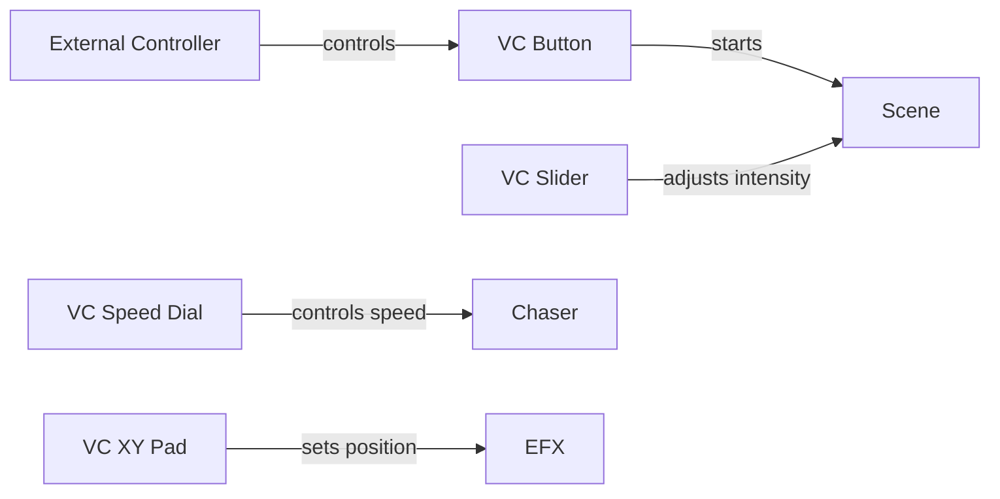

## Overview

The **Virtual Console** (VC) is QLC+'s interactive control interface. It allows you to create custom control surfaces with buttons, sliders, and other widgets to trigger and manipulate lighting during live shows.

<Info>
Think of Virtual Console as your custom lighting desk - arrange controls exactly how you need them for your show.
</Info>

## Core Concepts

### What is Virtual Console?

Virtual Console transforms your computer into a customizable lighting control surface:

- **Real-time Control**: Trigger scenes, chasers, and effects during performances
- **Custom Layouts**: Design control surfaces tailored to your workflow
- **External Control**: Connect MIDI, OSC, or DMX controllers
- **Multi-Page**: Organize controls across multiple pages
- **Visual Feedback**: Monitor function status and channel values

### Pages

The VC is organized into **pages** - separate control surfaces you can switch between:

```cpp
class VirtualConsole {
    QVector<VCPage*> m_pages;      // List of VC pages
    int m_selectedPage;             // Currently visible page
};
```

**Use Cases**:
- Different pages for different songs/scenes
- Separate operator and technician controls  
- Show sections (intro, verses, chorus, finale)
- Effects vs color control

<Note>
You can protect pages with a PIN to prevent accidental changes during shows.
</Note>

## Widget Types

Widgets are the interactive elements you place on the Virtual Console:

### Button Widget

The most common widget - triggers functions with a click.

```cpp
enum WidgetType {
    ButtonWidget,          // Function trigger
    SliderWidget,          // Value control
    XYPadWidget,          // 2D position control
    FrameWidget,          // Container for other widgets
    SoloFrameWidget,      // Exclusive function execution
    SpeedDialWidget,      // Chaser speed control
    CueListWidget,        // Sequential cue execution
    LabelWidget,          // Text display
    AudioTriggersWidget,  // Audio-reactive control
    AnimationWidget,      // Animated graphics
    ClockWidget          // Time display
};
```

**Button Features**:
- **Function Control**: Start/stop functions
- **Toggle/Flash**: Momentary or latching behavior
- **Key Bindings**: Keyboard shortcuts
- **External Input**: MIDI/OSC control
- **Custom Styling**: Colors, icons, background images

### Slider Widget

Control continuous values - intensity, speed, or individual channels.

<CardGroup cols={2}>
  <Card title="Playback Mode" icon="play">
    Control function intensity (submaster)
  </Card>
  <Card title="Level Mode" icon="sliders">
    Direct DMX channel control
  </Card>
</CardGroup>

**Slider Modes**:

```cpp
// Playback mode - control function intensity
slider->setPlaybackFunction(sceneId);
slider->setInvertedAppearance(false);

// Level mode - control fixture channels  
slider->setLevelMode(fixtureId, channelNum);
```

### Frame Widget

A **Frame** is a container that groups related widgets:

- Organize controls logically
- Collapse/expand groups
- Move multiple widgets together
- Apply styles to all children

**Solo Frame**: Special frame where only one child function can run at a time - perfect for mutually exclusive scenes.

### XY Pad Widget

Control two parameters simultaneously with 2D touch/mouse input:

- Pan/Tilt position for moving heads
- Color selection (hue/saturation)
- Effect parameters (width/height)

```cpp
xyPad->setFixturePosition(fixtureId, 
                          QLCChannel::Pan,   // X axis
                          QLCChannel::Tilt); // Y axis
```

### Cue List Widget

Manage sequential execution of cues (scenes/chasers):

- Step-by-step show progression
- Crossfade between cues
- Manual or automatic advancement
- Preset next cue

**Perfect for**:
- Theatre shows with defined sequences
- Timed presentations
- Song structure execution

### Speed Dial Widget

Control function speed in real-time:

- Attached to chaser or EFX
- Tap tempo functionality
- Multiply/divide speed
- Visual BPM display

### Other Widgets

- **Label**: Display text, show information
- **Audio Triggers**: React to audio input (frequency bands)
- **Animation**: Display animated GIFs or sequences
- **Clock**: Show current time or countdown

## Widget Properties

### Common Properties

All widgets share these properties:

```cpp
class VCWidget {
    quint32 m_id;              // Unique widget ID
    QString m_caption;         // Display text
    QRectF m_geometry;         // Position and size
    int m_page;                // Parent page number
    bool m_isDisabled;         // Disabled state
    bool m_isVisible;          // Visibility
    QColor m_backgroundColor;  // Background color
    QColor m_foregroundColor;  // Text/icon color
    QString m_backgroundImage; // Custom image
    QFont m_font;             // Text font
};
```

### Appearance Customization

```cpp
// Set colors
widget->setBackgroundColor(QColor("#FF0000"));
widget->setForegroundColor(QColor("#FFFFFF"));

// Set background image
widget->setBackgroundImage("file:///path/to/image.png");

// Set custom font
QFont font("Arial", 16, QFont::Bold);
widget->setFont(font);
```

## External Control

### Input Sources

Connect physical controllers to Virtual Console widgets:

```cpp
class QLCInputSource {
    quint32 universe;      // Input universe
    quint32 channel;       // Input channel
    quint8 lowerValue;     // Minimum value for feedback
    quint8 upperValue;     // Maximum value for feedback
    QString name;          // Control name
};
```

**Supported Protocols**:
- MIDI (controllers, keyboards)
- OSC (TouchOSC, Lemur)
- DMX Input (lighting consoles)
- Gamepad/Joystick
- Keyboard shortcuts

### Auto-Detection

```cpp
// Enable auto-detection for a widget
virtualConsole->createAndDetectInputSource(widget);

// Move a fader or press a button on your controller
// QLC+ automatically captures the input
```

### Key Sequences

Assign keyboard shortcuts to widgets:

```cpp
// Add keyboard shortcut
widget->addKeySequence(QKeySequence("Ctrl+1"), controlId);

// Multiple keys can control the same widget
widget->addKeySequence(QKeySequence("F1"), controlId);
```

<Tip>
Use keyboard shortcuts for quick access during shows - much faster than clicking!
</Tip>

## Practical Examples

### Creating a Button

```cpp
// Create button
VCButton *button = new VCButton(doc, virtualConsole);
button->setCaption("Red Wash");
button->setGeometry(QRectF(10, 10, 100, 50));

// Attach function
button->setFunction(redWashSceneId);

// Customize appearance
button->setBackgroundColor(QColor("#8B0000"));
button->setForegroundColor(Qt::white);

// Add to page
page->addWidget(button);
```

### Creating a Submaster Slider

```cpp
// Create slider
VCSlider *slider = new VCSlider(doc, virtualConsole);
slider->setCaption("Stage Wash");
slider->setGeometry(QRectF(10, 70, 50, 200));

// Set playback mode
slider->setSliderMode(VCSlider::Playback);
slider->setPlaybackFunction(washSceneId);

// Configure range
slider->setLevelLowLimit(0);
slider->setLevelHighLimit(255);

page->addWidget(slider);
```

### Creating a Frame with Multiple Buttons

```cpp
// Create frame
VCFrame *frame = new VCFrame(doc, virtualConsole);
frame->setCaption("Color Presets");
frame->setGeometry(QRectF(200, 10, 250, 150));

// Add buttons to frame
VCButton *redBtn = createColorButton("Red", redSceneId);
VCButton *blueBtn = createColorButton("Blue", blueSceneId);
VCButton *greenBtn = createColorButton("Green", greenSceneId);

frame->addChild(redBtn);
frame->addChild(blueBtn);
frame->addChild(greenBtn);

page->addWidget(frame);
```

### Creating a Cue List

```cpp
VCCueList *cueList = new VCCueList(doc, virtualConsole);
cueList->setCaption("Show Sequence");
cueList->setGeometry(QRectF(500, 10, 300, 400));

// Set chaser with cues
cueList->setChaser(showChaserId);

// Configure behavior
cueList->setNextPreviousKeysEnabled(true);
cueList->setCrossfade(true);

page->addWidget(cueList);
```

## Widget Interactions

### Solo Frame Behavior

In a Solo Frame, only one child function runs at a time:

```cpp
// Create solo frame
VCSoloFrame *soloFrame = new VCSoloFrame(doc, virtualConsole);

// Add buttons
soloFrame->addChild(button1);  // Controls Scene A
soloFrame->addChild(button2);  // Controls Scene B
soloFrame->addChild(button3);  // Controls Scene C

// When button2 is clicked:
// - Scene A stops
// - Scene B starts
// - Scene C remains stopped
```

**Use Cases**:
- Color selection (only one color active)
- Gobo selection (only one gobo pattern)
- Position presets (only one position active)

### Disable State

Widgets can be disabled to prevent interaction:

```cpp
// Disable widget (grayed out, no input)
widget->setDisabled(true);

// Frames can disable all children
frame->setDisabled(true);  // Disables frame and all child widgets
```

Useful for:
- Preventing accidental triggers
- Operator vs technician modes
- Show state management

## Feedback

Send visual feedback to external controllers:

```cpp
// Send value to controller LED/motor
widget->sendFeedback(255, controlId);  // Full brightness
widget->sendFeedback(0, controlId);    // Off
```

**Feedback Types**:
- Button state (on/off LEDs)
- Slider position (motorized faders)
- Function running status
- Channel monitoring

## Design Patterns

### Page Organization

**By Show Section**:
- Page 1: Pre-show
- Page 2: Intro
- Page 3: Main show
- Page 4: Finale

**By Control Type**:
- Page 1: Colors
- Page 2: Positions  
- Page 3: Effects
- Page 4: Special

**By Venue Area**:
- Page 1: Stage
- Page 2: Audience
- Page 3: Accents
- Page 4: Effects

### Widget Layout Tips

1. **Logical Grouping**: Use frames to group related controls
2. **Color Coding**: Use colors to indicate function type
3. **Size Matters**: Make frequently-used controls larger
4. **Leave Space**: Don't crowd controls - allow for expansion
5. **Label Clearly**: Use descriptive captions

## Best Practices

- **Test Layout**: Practice operating before the show
- **Backup Setup**: Save VC configurations regularly
- **Use Frames**: Organize complex setups with nested frames
- **External Control**: Set up backup keyboard shortcuts
- **Visual Feedback**: Use colors/icons to indicate state
- **Page Protection**: Use PINs for critical pages

## Performance Considerations

- **Widget Count**: Hundreds of widgets won't impact performance significantly
- **Background Images**: Large images may slow rendering
- **Audio Triggers**: CPU-intensive, use sparingly
- **Feedback**: Continuous feedback to many controllers adds overhead

<Warning>
Complex background images on many widgets can slow down the UI. Use solid colors when possible.
</Warning>

## Integration with Functions

Virtual Console widgets control functions:



## Related Concepts

- [Functions](/concepts/functions) - What Virtual Console widgets control
- [Fixtures](/concepts/fixtures) - The devices controlled by functions
- [Universes](/concepts/universes) - Where Virtual Console output is written
