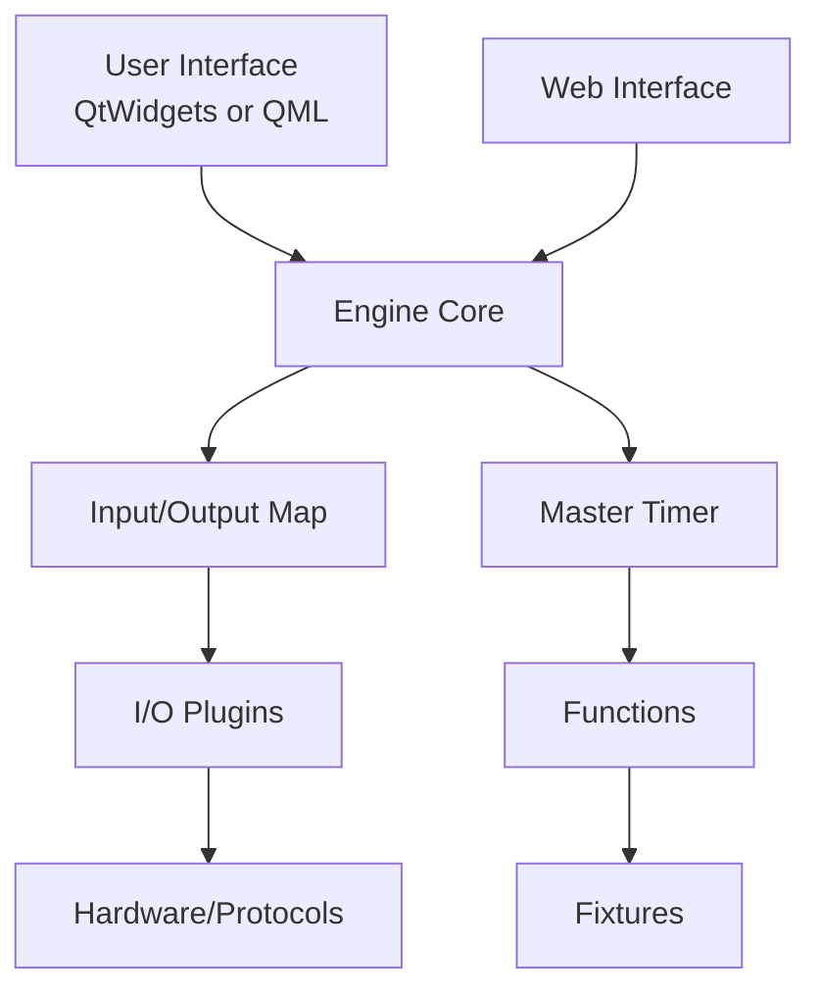
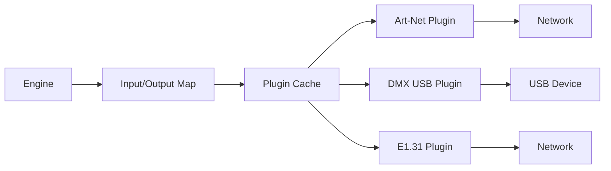

QLC+ is built with a modular architecture separating the core engine from the user interface and I/O plugins. This design enables multiple UI implementations and extensive hardware support.

## High-Level Architecture



## Core Components

### Engine

The engine (`engine/src/`) is the heart of QLC+, managing all lighting control logic independently of the UI.

<AccordionGroup>
  <Accordion title="Doc (engine/src/doc.h:54)">
    The main document class that owns and manages all project data:
    
    ```cpp
    class Doc final : public QObject
    {
        // Engine components
        QLCFixtureDefCache *fixtureDefCache();
        RGBScriptsCache *rgbScriptsCache();
        IOPluginCache *ioPluginCache();
        InputOutputMap *inputOutputMap();
        MasterTimer *masterTimer();
        
        // Fixture management
        bool addFixture(Fixture* fixture, quint32 id);
        Fixture* fixture(quint32 id) const;
        QList<Fixture*> const& fixtures() const;
        
        // Function management
        bool addFunction(Function* function, quint32 id);
        Function* function(quint32 id) const;
        QList<Function*> functions() const;
        
        // Operating modes
        enum Mode { Design = 0, Operate = 1 };
        void setMode(Mode mode);
    };
    ```
    
    **Responsibilities:**
    - Fixture and function lifecycle
    - Project loading/saving
    - Operating mode management (Design/Operate)
    - Engine component coordination
  </Accordion>

  <Accordion title="MasterTimer">
    The real-time engine that runs all functions and generates DMX output:
    
    - Runs at configurable rate (typically 50Hz)
    - Executes running functions
    - Manages faders and crossfades
    - Generates final DMX values
    - Handles Grand Master
    
    Thread-safe and runs independently of UI.
  </Accordion>

  <Accordion title="InputOutputMap (engine/src/inputoutputmap.h:27)">
    Manages the mapping between universes and I/O plugins:
    
    ```cpp
    class InputOutputMap : public QObject
    {
        // Universe management
        quint32 universes() const;
        
        // Plugin management
        IOPluginCache* pluginCache();
        
        // Patching
        bool setInputPatch(quint32 universe, const QString& pluginName,
                          quint32 input);
        bool setOutputPatch(quint32 universe, const QString& pluginName,
                           quint32 output);
        
        // DMX I/O
        void setUniverseValue(quint32 universe, quint32 channel, uchar value);
        uchar getUniverseValue(quint32 universe, quint32 channel);
    };
    ```
    
    **Features:**
    - Multiple universe support (default: 4)
    - Plugin hot-swapping
    - Input feedback
    - Pass-through mode
  </Accordion>
</AccordionGroup>

### Fixtures

<Info>
Fixtures are instances of fixture definitions, representing physical lighting devices.
</Info>

```cpp
class Fixture final : public QObject  // engine/src/fixture.h:71
{
    // Identity
    void setID(quint32 id);
    quint32 id() const;
    void setName(const QString& name);
    QString name() const;
    
    // Addressing
    void setUniverse(quint32 universe);
    quint32 universe() const;
    void setAddress(quint32 address);
    quint32 address() const;
    
    // Definition
    QLCFixtureDef* fixtureDef() const;
    QLCFixtureMode* fixtureMode() const;
    quint32 channels() const;
    
    // Channel access
    const QLCChannel* channel(quint32 channel) const;
};
```

**Fixture Definition Cache:**
- Loads `.qxf` files from `resources/fixtures/`
- Shared across multiple fixture instances
- Contains channel definitions, capabilities, and modes

### Functions

Functions are reusable lighting programs. All inherit from the base `Function` class (engine/src/function.h:93).

<Tabs>
  <Tab title="Scene">
    Sets specific DMX values for fixtures:
    
    ```cpp
    class Scene : public Function
    {
        // Set channel values
        void setValue(quint32 fixture, quint32 channel, uchar value);
        uchar value(quint32 fixture, quint32 channel);
        
        // Fade times
        void setFadeInSpeed(uint ms);
        void setFadeOutSpeed(uint ms);
    };
    ```
  </Tab>
  
  <Tab title="Chaser">
    Sequences multiple functions in order:
    
    ```cpp
    class Chaser : public Function
    {
        // Step management
        bool addStep(const ChaserStep& step);
        bool removeStep(int index);
        QList<ChaserStep> steps() const;
        
        // Playback
        enum RunOrder { Loop, PingPong, SingleShot };
        void setRunOrder(RunOrder order);
        void setDirection(Direction dir);
    };
    ```
  </Tab>
  
  <Tab title="EFX">
    Creates geometric movement patterns:
    
    ```cpp
    class EFX : public Function
    {
        // Algorithms
        enum Algorithm { Circle, Square, Diamond, Lissajous, ... };
        void setAlgorithm(Algorithm algo);
        
        // Fixture heads
        bool addFixture(EFXFixture* fixture);
        QList<EFXFixture*> fixtures();
    };
    ```
  </Tab>
  
  <Tab title="RGBMatrix">
    Controls LED matrix effects:
    
    ```cpp
    class RGBMatrix : public Function
    {
        // Script
        void setScript(const QString& name);
        RGBScript* script() const;
        
        // Fixture group
        void setFixtureGroup(quint32 id);
        
        // Animation
        enum AnimationStyle { Forward, Backward, PingPong, ... };
    };
    ```
  </Tab>
  
  <Tab title="Collection">
    Runs multiple functions simultaneously:
    
    ```cpp
    class Collection : public Function
    {
        // Function management
        bool addFunction(quint32 functionId);
        bool removeFunction(quint32 functionId);
        QList<quint32> functions() const;
    };
    ```
  </Tab>
</Tabs>

**Common Function Interface:**

```cpp
class Function : public QObject  // engine/src/function.h:93
{
public:
    enum Type {
        SceneType      = 1 << 0,
        ChaserType     = 1 << 1,
        EFXType        = 1 << 2,
        CollectionType = 1 << 3,
        ScriptType     = 1 << 4,
        RGBMatrixType  = 1 << 5,
        ShowType       = 1 << 6,
        SequenceType   = 1 << 7,
        AudioType      = 1 << 8,
        VideoType      = 1 << 9
    };
    
    // Lifecycle
    virtual void start(MasterTimer* timer, FunctionParent* parent);
    virtual void stop(FunctionParent* parent);
    virtual void write(MasterTimer* timer, QList<Universe*> universes);
    
    // Properties
    void setName(const QString& name);
    Type type() const;
    quint32 totalDuration() const;
};
```

## User Interfaces

QLC+ supports two UI implementations:

### QtWidgets UI (QLC+ 4)

Traditional desktop interface in `ui/src/`:

- **Virtual Console** - Live control interface
- **Simple Desk** - Direct channel control
- **Show Manager** - Timeline editor
- **Fixture Manager** - Fixture patching
- **Function Manager** - Function creation/editing
- **Input/Output** - Plugin configuration

### QML UI (QLC+ 5)

Touch-optimized interface in `qmlui/`:

- Modern, responsive design
- Better touch support
- 3D visualization
- Same engine underneath

Built with Qt3D for 3D preview features.

### Web Interface

The `webaccess/` module provides browser-based control:

- Remote control via HTTP
- Virtual console access
- Simple desk
- Function triggering
- No installation required on client

## Plugin System

<Info>
Plugins provide hardware I/O and protocol support through a common interface.
</Info>

### Plugin Interface

All plugins implement `QLCIOPlugin` (plugins/interfaces/qlcioplugin.h:90):

```cpp
class QLCIOPlugin : public QObject
{
public:
    enum Capability {
        Output   = 1 << 0,  // DMX output
        Input    = 1 << 1,  // DMX input
        Feedback = 1 << 2,  // Input feedback
        Infinite = 1 << 3,  // Unlimited universes
        RDM      = 1 << 4,  // RDM support
        Beats    = 1 << 5   // Beat detection
    };
    
    // Initialization
    virtual void init() = 0;
    virtual QString name() const = 0;
    virtual int capabilities() const = 0;
    
    // I/O lines
    virtual QStringList outputs() const = 0;
    virtual QStringList inputs() const = 0;
    
    // Open/close
    virtual bool openOutput(quint32 output, quint32 universe) = 0;
    virtual void closeOutput(quint32 output, quint32 universe) = 0;
    virtual bool openInput(quint32 input, quint32 universe) = 0;
    virtual void closeInput(quint32 input, quint32 universe) = 0;
    
    // Data transfer
    virtual void writeUniverse(quint32 universe, quint32 output,
                               const QByteArray& data) = 0;
    
signals:
    void valueChanged(quint32 universe, quint32 input,
                     quint32 channel, uchar value);
};
```

### Available Plugins

Plugins in `plugins/`:

<CardGroup cols={2}>
  <Card title="DMX USB" icon="usb">
    - ENTTEC DMX USB Pro
    - DMXKing
    - Eurolite
    - Many USB-DMX adapters
  </Card>
  
  <Card title="Art-Net" icon="network-wired">
    - Art-Net III protocol
    - Multiple universes
    - Broadcast and unicast
  </Card>
  
  <Card title="E1.31 (sACN)" icon="network-wired">
    - ANSI E1.31 protocol
    - Streaming ACN
    - Multicast support
  </Card>
  
  <Card title="MIDI" icon="music">
    - MIDI input/output
    - Show control
    - External controller support
  </Card>
  
  <Card title="OSC" icon="wave-sine">
    - Open Sound Control
    - Network-based control
    - TouchOSC compatible
  </Card>
  
  <Card title="HID" icon="gamepad">
    - Generic HID devices
    - Keyboards
    - Game controllers
  </Card>
  
  <Card title="OLA" icon="plug">
    - Open Lighting Architecture
    - Many protocols via OLA
  </Card>
  
  <Card title="Loopback" icon="arrows-rotate">
    - Internal universe routing
    - Testing
  </Card>
</CardGroup>

### Plugin Architecture



## Data Flow

### DMX Output Pipeline

<Steps>
  <Step title="Function Execution">
    MasterTimer calls `write()` on each running function
  </Step>
  
  <Step title="Value Generation">
    Functions generate channel values based on their logic
  </Step>
  
  <Step title="Fader Application">
    GenericFader applies fade curves and HTP/LTP rules
  </Step>
  
  <Step title="Universe Assembly">
    MasterTimer combines all values into universe buffers
  </Step>
  
  <Step title="Plugin Output">
    InputOutputMap sends universe data to plugins via `writeUniverse()`
  </Step>
  
  <Step title="Hardware Transmission">
    Plugins transmit data to physical hardware/network
  </Step>
</Steps>

### Input Processing

<Steps>
  <Step title="Hardware Input">
    Plugin receives input from hardware
  </Step>
  
  <Step title="Signal Emission">
    Plugin emits `valueChanged()` signal
  </Step>
  
  <Step title="Input Map">
    InputOutputMap receives and routes input
  </Step>
  
  <Step title="Profile Application">
    Input profiles map physical controls to channels
  </Step>
  
  <Step title="Widget Handling">
    Virtual Console widgets respond to input
  </Step>
</Steps>

## Resource Management

### Fixture Definitions

- **Location:** `resources/fixtures/`
- **Format:** XML (`.qxf` files)
- **Cache:** `QLCFixtureDefCache`
- **Validation:** XML schema in `resources/schemas/`

### RGB Scripts

- **Location:** `resources/rgbscripts/`
- **Format:** JavaScript
- **API Version:** 2
- **Cache:** `RGBScriptsCache`

See [RGB Scripts](/development/rgb-scripts) for API details.

### Input Profiles

- **Location:** `resources/inputprofiles/`
- **Format:** XML
- **Purpose:** Map input devices to QLC+ controls

## Threading Model

<Warning>
The MasterTimer runs in its own thread. All function `write()` methods must be thread-safe.
</Warning>

### Thread Organization

- **Main Thread:** UI and user interaction
- **MasterTimer Thread:** Function execution and DMX generation
- **Plugin Threads:** Some plugins use separate threads for I/O

### Thread Safety

- Use `QMutex` for shared data structures
- Emit signals across thread boundaries
- Be careful with `Doc` access from MasterTimer

## Build System Integration

The architecture is reflected in the CMake structure (CMakeLists.txt:73-89):

```cmake
add_subdirectory(hotplugmonitor)
add_subdirectory(engine)
add_subdirectory(resources)
add_subdirectory(plugins)
add_subdirectory(webaccess)
if(qmlui)
    add_subdirectory(qmlui)
else()
    add_subdirectory(ui)
    add_subdirectory(main)
    add_subdirectory(fixtureeditor)
endif()
```

## Next Steps

- [Build QLC+](/development/building) to explore the code
- [Create plugins](/development/plugins) to add hardware support
- [Write functions](/api/functions) to understand the function API
- [Study the engine](/api/engine) for core class details
